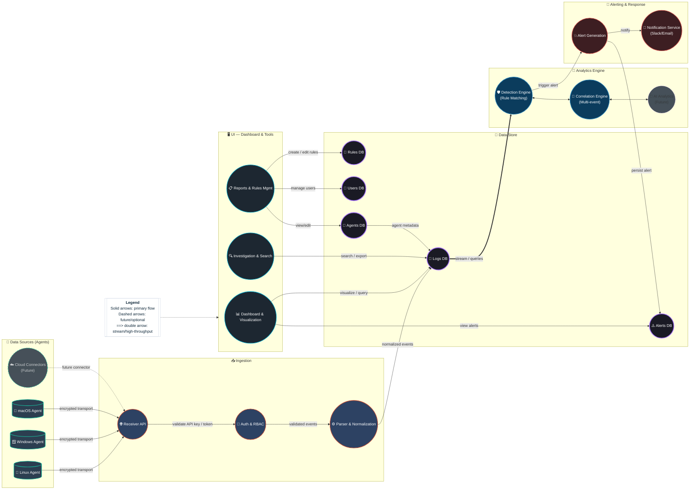

# RAMSRAN Security Platform — Architecture

```mermaid
%% (Paste the entire contents of diagrams/architecture.mmd here)
graph LR
  %% Styles
  classDef sourceStyle fill:#2c3e50,stroke:#18bc9c,stroke-width:2px,color:#ffffff;
  classDef ingestStyle fill:#2d4263,stroke:#c84b31,stroke-width:2px,color:#ffffff;
  classDef dbStyle fill:#1a1a24,stroke:#a370f7,stroke-width:3px,color:#ffffff;
  classDef engineStyle fill:#0b3c5d,stroke:#328cc1,stroke-width:2px,color:#ffffff;
  classDef alertStyle fill:#3d1e22,stroke:#d9534f,stroke-width:2px,color:#ffffff;
  classDef uiStyle fill:#1d2731,stroke:#00a8cc,stroke-width:2px,color:#ffffff;
  classDef futureStyle stroke-dasharray: 6 4, opacity:0.85, fill:#263242;
  classDef noteStyle fill:#ffffff,stroke:#cbd5e1,stroke-width:1px,color:#0b2436;

  subgraph Sources ["🔌 Data Sources (Agents)"]
    direction TB
    Src_Lin[("🐧 Linux Agent")]
    Src_Win[("🪟 Windows Agent")]
    Src_Mac[("🍏 macOS Agent")]
    Src_Cloud(("☁️ Cloud Connectors\n(Future)"))
  end
  class Src_Lin,Src_Win,Src_Mac,Src_Cloud sourceStyle;
  class Src_Cloud futureStyle;

  subgraph Ingest ["📥 Ingestion"]
    direction TB
    Recv(("🌐 Receiver API"))
    Auth(("🔑 Auth & RBAC"))
    Norm(("⚙️ Parser & Normalization"))
  end
  class Recv,Auth,Norm ingestStyle;

  subgraph DataStore ["💾 Data Store"]
    direction TB
    DB_Log(("📝 Logs DB"))
    DB_Alert(("⚠️ Alerts DB"))
    DB_Rule(("📜 Rules DB"))
    DB_User(("👤 Users DB"))
    DB_Agent(("🤖 Agents DB"))
  end
  class DB_Log,DB_Alert,DB_Rule,DB_User,DB_Agent dbStyle;

  subgraph Engine ["🧠 Analytics Engine"]
    direction TB
    Detect(("🛡️ Detection Engine\n(Rule Matching)"))
    Correl(("🔄 Correlation Engine\n(Multi-event)"))
    AI(("🤖 AI Analytics\n(Future)"))
  end
  class Detect,Correl engineStyle;
  class AI futureStyle;

  subgraph Alerts ["🚨 Alerting & Response"]
    direction TB
    Gen(("💥 Alert Generation"))
    Notif(("🔔 Notification Service\n(Slack/Email)"))
  end
  class Gen,Notif alertStyle;

  subgraph UI ["🖥️ UI — Dashboard & Tools"]
    direction TB
    Dash(("📊 Dashboard & Visualization"))
    Invest(("🔍 Investigation & Search"))
    Rep(("📋 Reports & Rules Mgmt"))
  end
  class Dash,Invest,Rep uiStyle;

  Src_Lin & Src_Win & Src_Mac -->|encrypted transport| Recv
  Src_Cloud -.->|future connector| Recv

  Recv -->|validate API key / token| Auth
  Auth -->|validated events| Norm
  Norm -->|normalized events| DB_Log

  DB_Log ==>|stream / queries| Detect
  Detect <--> Correl
  Correl <--> AI

  Detect -->|trigger alert| Gen
  Gen -->|notify| Notif
  Gen -->|persist alert| DB_Alert

  Dash -->|visualize / query| DB_Log
  Dash -->|view alerts| DB_Alert
  Invest -->|search / export| DB_Log
  Rep -->|create / edit rules| DB_Rule
  Rep -->|manage users| DB_User

  DB_Agent -->|agent metadata| DB_Log
  Rep -->|view/edit| DB_Agent

  subgraph Legend [ ]
    style Legend fill:none,stroke:none
    L1[[<b>Legend</b><br/>Solid arrows: primary flow<br/>Dashed arrows: future/optional<br/>==> double arrow: stream/high-throughput]]
  end
  class L1 noteStyle;
  L1 -.-> UI
```
