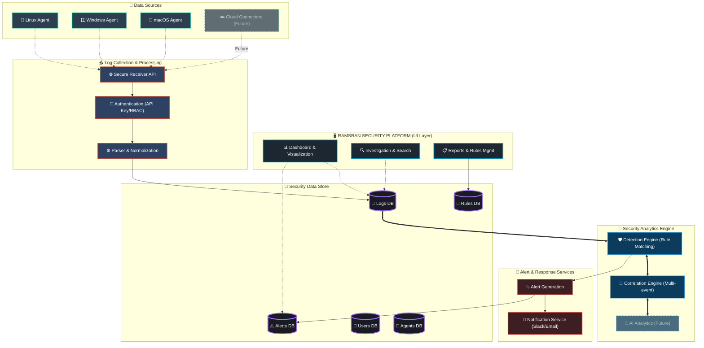

# Project
# RAMSRAN Security Platform Architecture

```mermaid
graph TD
    %% Styling and Configuration
    %% Theme variables for a modern security platform look
    classDef uiStyle fill:#1d2731,stroke:#00a8cc,stroke-width:2px,color:#fff;
    classDef engineStyle fill:#0b3c5d,stroke:#328cc1,stroke-width:2px,color:#fff;
    classDef alertStyle fill:#3d1e22,stroke:#d9534f,stroke-width:2px,color:#fff;
    classDef ingestStyle fill:#2d4263,stroke:#c84b31,stroke-width:2px,color:#fff;
    classDef dbStyle fill:#1a1a24,stroke:#a370f7,stroke-width:3px,color:#fff;
    classDef sourceStyle fill:#2c3e50,stroke:#18bc9c,stroke-width:2px,color:#fff;
    classDef futureStyle stroke-dasharray: 5 5, opacity:0.75;

    %% --- UI & FRONTEND LAYER ---
    subgraph UI ["🖥️ RAMSRAN SECURITY PLATFORM (UI Layer)"]
        Dash["📊 Dashboard & Visualization"]
        Invest["🔍 Investigation & Search"]
        Rep["📋 Reports & Rules Mgmt"]
    end
    class Dash,Invest,Rep uiStyle;

    %% --- SECURITY ANALYTICS ENGINE LAYER ---
    subgraph Engine ["🧠 Security Analytics Engine"]
        Detect["🛡️ Detection Engine (Rule Matching)"]
        Correl["🔄 Correlation Engine (Multi-event)"]
        AI["🤖 AI Analytics (Future)"]
    end
    class Detect,Correl,AI engineStyle;
    class AI futureStyle;

    %% --- ALERT & RESPONSE SERVICES ---
    subgraph Alerts ["🚨 Alert & Response Services"]
        Gen["💥 Alert Generation"]
        Notif["🔔 Notification Service (Slack/Email)"]
    end
    class Gen,Notif alertStyle;

    %% --- LOG COLLECTION & PROCESSING ---
    subgraph Ingest ["📥 Log Collection & Processing"]
        Recv["🌐 Secure Receiver API"]
        Auth["🔑 Authentication (API Key/RBAC)"]
        Parse["⚙️ Parser & Normalization"]
    end
    class Recv,Auth,Parse ingestStyle;

    %% --- SECURITY DATA STORE ---
    subgraph DataStore ["💾 Security Data Store"]
        DB_Log[("📝 Logs DB")]
        DB_Alert[("⚠️ Alerts DB")]
        DB_Rule[("📜 Rules DB")]
        DB_User[("👤 Users DB")]
        DB_Agent[("🤖 Agents DB")]
    end
    class DB_Log,DB_Alert,DB_Rule,DB_User,DB_Agent dbStyle;

    %% --- DATA SOURCES ---
    subgraph Sources ["🔌 Data Sources"]
        Src_Lin["🐧 Linux Agent"]
        Src_Win["🪟 Windows Agent"]
        Src_Mac["🍏 macOS Agent"]
        Src_Cloud["☁️ Cloud Connectors (Future)"]
    end
    class Src_Lin,Src_Win,Src_Mac,Src_Cloud sourceStyle;
    class Src_Cloud futureStyle;

    %% --- ROUTING & DATA FLOWS ---
    %% Ingestion Pipeline
    Src_Lin & Src_Win & Src_Mac -.-> Recv
    Src_Cloud -.->|Future| Recv
    Recv --> Auth --> Parse
    Parse --> DB_Log

    %% Analytics Pipeline
    DB_Log ==> Detect
    Detect <==> Correl
    Correl <==> AI
    
    %% Alerting Flow
    Detect --> Gen --> Notif
    Gen --> DB_Alert

    %% UI Connections
    Dash -.-> DB_Log & DB_Alert
    Invest -.-> DB_Log
    Rep --> DB_Rule
```
